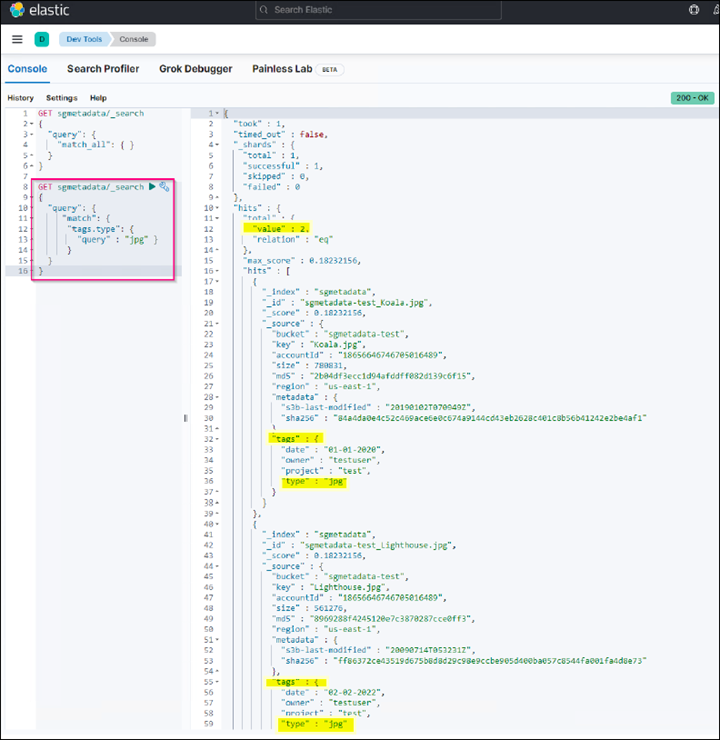

= Configurare il servizio di integrazione della ricerca StorageGRID
:allow-uri-read: 

_Angela Cheng_

[role="lead"]
Questa guida fornisce istruzioni dettagliate per la configurazione del servizio di integrazione della ricerca di NetApp StorageGRID 11.6 con il servizio Amazon OpenSearch o on-premise Elasticsearch.

== Introduzione

StorageGRID supporta tre tipi di servizi di piattaforma.

* *Replica di StorageGRID CloudMirror*. Eseguire il mirroring di oggetti specifici da un bucket StorageGRID a una destinazione esterna specificata.
* *Notifiche*. Notifiche di eventi per bucket per inviare notifiche su azioni specifiche eseguite su oggetti a un servizio Amazon Simple Notification Service (Amazon SNS) esterno specificato.
* *Ricerca servizio di integrazione*. Inviare metadati di oggetti Simple Storage Service (S3) a un indice Elasticsearch specificato, in cui è possibile cercare o analizzare i metadati utilizzando il servizio esterno.

I servizi della piattaforma vengono configurati dal tenant S3 tramite l'interfaccia utente di Tenant Manager. Per ulteriori informazioni, vedere https://docs.netapp.com/us-en/storagegrid-116/tenant/considerations-for-using-platform-services.html["Considerazioni sull'utilizzo dei servizi della piattaforma"^].

Il presente documento costituisce un'integrazione di https://docs.netapp.com/us-en/storagegrid-116/tenant/index.html["Guida al tenant di StorageGRID 11.6"^] inoltre, fornisce istruzioni dettagliate ed esempi per la configurazione di endpoint e bucket per i servizi di integrazione della ricerca. Le istruzioni di configurazione di Amazon Web Services (AWS) o on-premise Elasticsearch qui incluse sono esclusivamente a scopo dimostrativo o di test di base.

Gli utenti devono avere familiarità con Grid Manager, il tenant manager, e avere accesso al browser S3 per eseguire operazioni di caricamento (PUT) e download (GET) di base per il test di integrazione della ricerca StorageGRID.

== Creare tenant e abilitare i servizi della piattaforma

. Creare un tenant S3 utilizzando Grid Manager, immettere un nome visualizzato e selezionare il protocollo S3.
. Nella pagina Permission, selezionare l'opzione Allow Platform Services (Consenti servizi piattaforma). Se necessario, selezionare altre autorizzazioni.
+
image::../media/storagegrid-search-integration-service/sg-sis-select-permissions.png[Selezionare la schermata delle autorizzazioni]

. Impostare la password iniziale dell'utente root tenant oppure, se l'opzione identifica federazione è attivata sulla griglia, selezionare il gruppo federated che dispone dell'autorizzazione di accesso root per configurare l'account tenant.
. Fare clic su Accedi come root e selezionare bucket: Crea e gestisci bucket.
+
Viene visualizzata la pagina del tenant manager.

. Da Tenant Manager, selezionare My Access Keys (chiavi di accesso personali) per creare e scaricare la chiave di accesso S3 per i test successivi.

== Cerca servizi di integrazione con Amazon OpenSearch

=== Configurazione del servizio Amazon OpenSearch (precedentemente chiamato Elasticsearch)

Utilizzare questa procedura per una configurazione rapida e semplice del servizio OpenSearch solo a scopo di test/demo. Se si utilizza on-premise Elasticsearch per i servizi di integrazione della ricerca, consultare la sezione xref:search-integration-services-with-on-premises-elasticsearch[Cerca servizi di integrazione con Elasticsearch on premise].

NOTE: Per iscriversi al servizio OpenSearch, è necessario disporre di un account di accesso alla console AWS valido, di una chiave di accesso, di una chiave di accesso segreta e dell'autorizzazione.

. Creare un nuovo dominio utilizzando le istruzioni fornite da link:https://docs.aws.amazon.com/opensearch-service/latest/developerguide/gsgcreate-domain.html["Guida introduttiva al servizio AWS OpenSearch"^], ad eccezione di:
+
** Fase 4. Nome di dominio: Sgdemo
** Fase 10. Controllo degli accessi dettagliato: Deselezionare l'opzione Enable fine-Grained Access Control (attiva controllo degli accessi con grana fine).
** Fase 12. Access policy (criterio di accesso): Selezionare Configure Level Access Policy (Configura policy di accesso a livello), selezionare la scheda JSON per modificare la policy di accesso utilizzando il seguente esempio:
+
*** Sostituire il testo evidenziato con il proprio ID AWS Identity and Access Management (IAM) e il proprio nome utente.
*** Sostituire il testo evidenziato (l'indirizzo IP) con l'indirizzo IP pubblico del computer locale utilizzato per accedere alla console AWS.
*** Aprire una scheda del browser in https://checkip.amazonaws.com/["https://checkip.amazonaws.com"^] Per trovare l'IP pubblico.
+
[source, json]
----
{

    "Version": "2012-10-17",
    "Statement": [
        {
        "Effect": "Allow",
        "Principal":
        {"AWS": "arn:aws:iam:: nnnnnn:user/xyzabc"},
        "Action": "es:*",
        "Resource": "arn:aws:es:us-east-1:nnnnnn:domain/sgdemo/*"
        },
        {
        "Effect": "Allow",
        "Principal": {"AWS": "*"},
        "Action": [
        "es:ESHttp*"
                ],
        "Condition": {
            "IpAddress": {
                "aws:SourceIp": [ "nnn.nnn.nn.n/nn"
                    ]
                }
        },
        "Resource": "arn:aws:es:us-east-1:nnnnnn:domain/sgdemo/*"
        }
    ]
}
----
+
image::../media/storagegrid-search-integration-service/sg-sis-search-integration-amazon-opensearch.png[Schermata di integrazione della ricerca]

. Attendere da 15 a 20 minuti per attivare il dominio.
+
image::../media/storagegrid-search-integration-service/sg-sis-activating-domain.png[Schermata di attivazione del dominio]

. Fare clic su OpenSearch Dashboards URL (URL dashboard OpenSearch) per aprire il dominio in una nuova scheda e accedere alla dashboard. Se viene visualizzato un errore di accesso negato, verificare che l'indirizzo IP di origine del criterio di accesso sia impostato correttamente sull'IP pubblico del computer per consentire l'accesso alla dashboard del dominio.
. Nella pagina di benvenuto della dashboard, selezionare Esplora da solo. Dal menu, selezionare Management (Gestione) -> Dev Tools (Strumenti di sviluppo)
. In Strumenti di sviluppo -> Console , immettere `PUT <index>` Dove si utilizza l'indice per memorizzare i metadati degli oggetti StorageGRID. Nell'esempio seguente viene utilizzato il nome dell'indice "sgmetadata". Fare clic sul piccolo simbolo del triangolo per eseguire IL comando PUT. Il risultato previsto viene visualizzato sul pannello di destra, come mostrato nella seguente schermata di esempio.
+
image::../media/storagegrid-search-integration-service/sg-sis-using-put-command-for-index.png[Utilizzo del comando put per la schermata dell'indice]

. Verificare che l'indice sia visibile dall'interfaccia utente di Amazon OpenSearch in sgdomain > indici.
+
image::../media/storagegrid-search-integration-service/sg-sis-verifying-the-index.png[Schermata Verifying-the-index]

== Configurazione degli endpoint dei servizi della piattaforma

Per configurare gli endpoint dei servizi della piattaforma, attenersi alla seguente procedura:

. In Tenant Manager, andare a STORAGE(S3) > Platform Services Endpoint.
. Fare clic su Create Endpoint (Crea endpoint), immettere quanto segue, quindi fare clic su Continue (continua):
+
** Esempio di nome visualizzato `aws-opensearch`
** L'endpoint di dominio nella schermata di esempio nella fase 2 della procedura precedente nel campo URI.
** Il dominio ARN utilizzato nella fase 2 della procedura precedente nel campo URN e aggiungere `/<index>/_doc` Alla fine di ARN.
+
In questo esempio, URN diventa `arn:aws:es:us-east-1:211234567890:domain/sgdemo /sgmedata/_doc`.

+
image::../media/storagegrid-search-integration-service/sg-sis-enter-end-points-details.png[screenshot di end-point-details]

. Per accedere a Amazon OpenSearch sgdomain, scegli Access Key come tipo di autenticazione, quindi inserisci la chiave di accesso Amazon S3 e la chiave segreta. Per passare alla pagina successiva, fare clic su Continue (continua).
+
image::../media/storagegrid-search-integration-service/sg-sis-authenticate-connections-to-endpoints.png[schermata authenticate connections to endpoint (autenticare le connessioni]

. Per verificare l'endpoint, selezionare Use Operating System CA Certificate and Test (Usa certificato CA del sistema operativo e test) e Create Endpoint (Crea endpoint). Se la verifica ha esito positivo, viene visualizzata una schermata dell'endpoint simile alla seguente figura. Se la verifica non riesce, verificare che l'URN includa `/<index>/_doc` Alla fine del percorso, la chiave di accesso AWS e la chiave segreta sono corrette.
+
image::../media/storagegrid-search-integration-service/sg-sis-platform-service-endpoints.png[endpoint del servizio della piattaforma screenshot]

== Cerca servizi di integrazione con Elasticsearch on premise

=== Configurazione di Elasticsearch on premise

Questa procedura è per una rapida configurazione di on premise Elasticsearch e Kibana utilizzando docker solo a scopo di test. Se il server Elasticsearch e Kibana esiste già, passare alla fase 5.

. Seguire questa procedura link:https://docs.docker.com/engine/install/["Procedura di installazione di Docker"^] per installare docker. Utilizziamo il link:https://docs.docker.com/engine/install/centos/["Procedura di installazione di CentOS Docker"^] in questa configurazione.
+
--
....
sudo yum install -y yum-utils
sudo yum-config-manager --add-repo https://download.docker.com/linux/centos/docker-ce.repo
sudo yum install docker-ce docker-ce-cli containerd.io
sudo systemctl start docker
....
--
+
** Per avviare docker dopo il riavvio, immettere quanto segue:
+
--
 sudo systemctl enable docker
--
** Impostare `vm.max_map_count` valore 262144:
+
--
 sysctl -w vm.max_map_count=262144
--
** Per mantenere l'impostazione dopo il riavvio, immettere quanto segue:
+
--
 echo 'vm.max_map_count=262144' >> /etc/sysctl.conf
--

. Seguire la link:https://www.elastic.co/guide/en/elasticsearch/reference/current/getting-started.html["Elasticsearch Guida introduttiva"^] Sezione autogestito per installare ed eseguire il docker Elasticsearch e Kibana. In questo esempio, è stata installata la versione 8.1.
+

TIP: Annotare il nome utente/password e il token creati da Elasticsearch, necessari per avviare l'autenticazione dell'interfaccia utente Kibana e dell'endpoint della piattaforma StorageGRID.

+
image::../media/storagegrid-search-integration-service/sg-sis-search-integration-elasticsearch.png[schermata di ricerca dell'integrazione elasticsearch]

. Una volta avviato il container Kibana docker, viene visualizzato il link URL `\https://0.0.0.0:5601` viene visualizzato nella console. Sostituire 0.0.0.0 con l'indirizzo IP del server nell'URL.
. Accedere all'interfaccia utente di Kibana utilizzando il nome utente `elastic` E la password generata da Elastic nel passaggio precedente.
. Per il primo accesso, nella pagina di benvenuto della dashboard, selezionare Esplora da solo. Dal menu, selezionare Management (Gestione) > Dev Tools (Strumenti di sviluppo).
. Nella schermata Console di Dev Tools, immettere `PUT <index>` Dove si utilizza questo indice per memorizzare i metadati degli oggetti StorageGRID. Utilizziamo il nome dell'indice `sgmetadata` in questo esempio. Fare clic sul piccolo simbolo del triangolo per eseguire IL comando PUT. Il risultato previsto viene visualizzato sul pannello di destra, come mostrato nella seguente schermata di esempio.
+
image::../media/storagegrid-search-integration-service/sg-sis-execute-put-command.png[Eseguire il comando put]

== Configurazione degli endpoint dei servizi della piattaforma

Per configurare gli endpoint per i servizi della piattaforma, attenersi alla seguente procedura:

. In Tenant Manager, andare a STORAGE(S3) > Platform Services Endpoint
. Fare clic su Create Endpoint (Crea endpoint), immettere quanto segue, quindi fare clic su Continue (continua):
+
** Esempio di nome visualizzato: `elasticsearch`
** URI: `\https://<elasticsearch-server-ip or hostname>:9200`
** URNA: `urn:<something>:es:::<some-unique-text>/<index-name>/_doc` Dove index-name è il nome utilizzato sulla console Kibana. Esempio: `urn:local:es:::sgmd/sgmetadata/_doc`
+
image::../media/storagegrid-search-integration-service/sg-sis-platform-service-endpoint-details.png[Schermata dei dettagli degli endpoint del servizio della piattaforma]

. Selezionare HTTP di base come tipo di autenticazione, quindi immettere il nome utente `elastic` E la password generata dal processo di installazione di Elasticsearch. Per passare alla pagina successiva, fare clic su Continue (continua).
+

. Selezionare non verificare certificato e test e Crea endpoint per verificare l'endpoint. Se la verifica ha esito positivo, viene visualizzata una schermata dell'endpoint simile alla seguente schermata. Se la verifica non riesce, verificare che le voci URN, URI e nome utente/password siano corrette.
+
image::../media/storagegrid-search-integration-service/sg-sis-successfully-verified-endpoint.png[Endpoint verificato correttamente]

== Configurazione del servizio di integrazione della ricerca nel bucket

Una volta creato l'endpoint del servizio della piattaforma, il passaggio successivo consiste nel configurare questo servizio a livello di bucket per inviare i metadati dell'oggetto all'endpoint definito ogni volta che un oggetto viene creato, cancellato o i relativi metadati o tag vengono aggiornati.

È possibile configurare l'integrazione della ricerca utilizzando Tenant Manager per applicare un XML di configurazione StorageGRID personalizzato a un bucket come segue:

. In Tenant Manager, andare a STORAGE(S3) > Bucket
. Fare clic su Create bucket (Crea bucket), inserire il nome del bucket (ad esempio, `sgmetadata-test`) e accettare l'impostazione predefinita `us-east-1` regione.
. Fare clic su continua > Crea bucket.
. Per visualizzare la pagina Panoramica del bucket, fare clic sul nome del bucket, quindi selezionare Platform Services (servizi piattaforma).
. Selezionare la finestra di dialogo Enable Search Integration (attiva integrazione ricerca). Nella casella XML fornita, immettere il file XML di configurazione utilizzando questa sintassi.
+
L'URN evidenziato deve corrispondere all'endpoint dei servizi della piattaforma definito dall'utente. È possibile aprire un'altra scheda del browser per accedere a Tenant Manager e copiare l'URN dall'endpoint dei servizi della piattaforma definito.

+
In questo esempio, non abbiamo utilizzato alcun prefisso, il che significa che i metadati per ogni oggetto in questo bucket vengono inviati all'endpoint Elasticsearch definito in precedenza.

+
[listing]
----
<MetadataNotificationConfiguration>
    <Rule>
        <ID>Rule-1</ID>
        <Status>Enabled</Status>
        <Prefix></Prefix>
        <Destination>
            <Urn> urn:local:es:::sgmd/sgmetadata/_doc</Urn>
        </Destination>
    </Rule>
</MetadataNotificationConfiguration>
----
. Utilizzare S3 browser per connettersi a StorageGRID con la chiave di accesso/segreto del tenant e caricare gli oggetti di test in `sgmetadata-test` bucket e aggiunta di tag o metadati personalizzati agli oggetti.
+
image::../media/storagegrid-search-integration-service/sg-sis-upload-test-objects.png[Carica la schermata degli oggetti di test]

. Utilizzare l'interfaccia utente di Kibana per verificare che i metadati dell'oggetto siano stati caricati nell'indice di sgmetadata.
+
.. Dal menu, selezionare Management (Gestione) > Dev Tools (Strumenti di sviluppo).
.. Incollare la query di esempio nel pannello della console a sinistra e fare clic sul simbolo del triangolo per eseguirla.
+
Il risultato dell'esempio di query 1 nella seguente schermata di esempio mostra quattro record. Questo corrisponde al numero di oggetti nel bucket.

+
[listing]
----
GET sgmetadata/_search
{
    "query": {
        "match_all": { }
}
}
----
+
image::../media/storagegrid-search-integration-service/sg-sis-query1-sample-result.png[Schermata dei risultati di esempio della query 1]

+
Il risultato dell'esempio di query 2 nella seguente schermata mostra due record con il tipo di tag jpg.

+
[listing]
----
GET sgmetadata/_search
{
    "query": {
        "match": {
            "tags.type": {
                "query" : "jpg" }
                }
            }
}
----
+

== Dove trovare ulteriori informazioni

Per ulteriori informazioni sulle informazioni descritte in questo documento, consultare i seguenti documenti e/o siti Web:

* https://docs.netapp.com/us-en/storagegrid-116/tenant/what-platform-services-are.html["Cosa sono i servizi della piattaforma"^]
* https://docs.netapp.com/us-en/storagegrid-116/index.html["Documentazione di StorageGRID 11.6"^]

