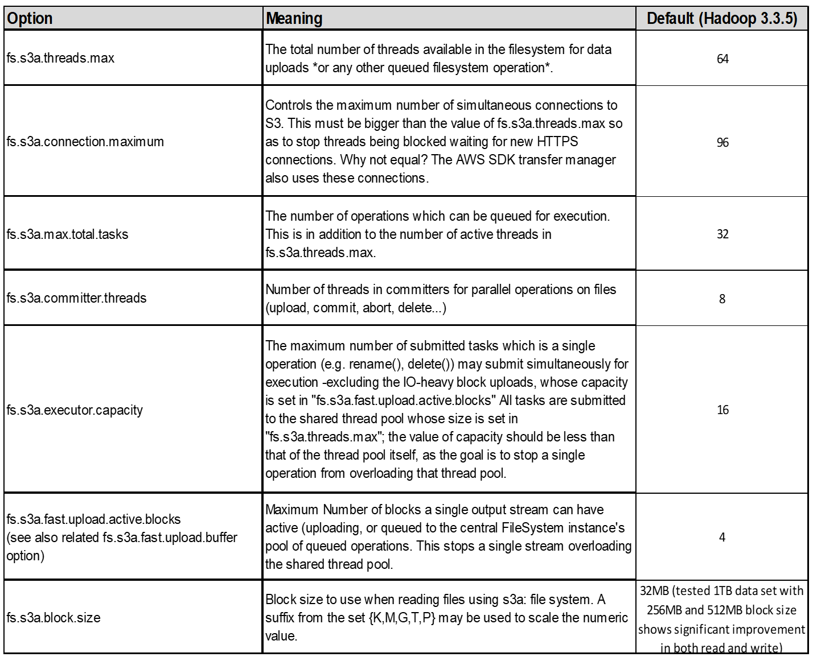
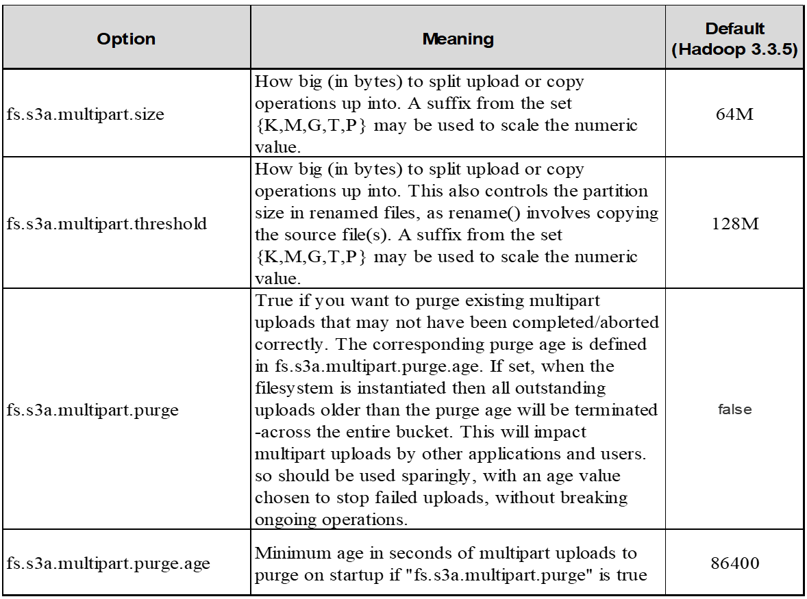

= Tuning di Hadoop S3A
:allow-uri-read: 

Il connettore Hadoop S3A facilita un'interazione perfetta tra le applicazioni basate su Hadoop e lo storage a oggetti S3. La messa a punto del connettore Hadoop S3A è essenziale per ottimizzare le performance quando si lavora con lo storage a oggetti S3. Prima di entrare nei dettagli di messa a punto, cerchiamo di comprendere di base Hadoop e i suoi componenti.

== Che cos'è Hadoop?

*Hadoop* è un potente framework open-source progettato per gestire l'elaborazione e lo storage di dati su larga scala. Permette lo storage distribuito e l'elaborazione parallela tra cluster di computer.

I tre componenti principali di Hadoop sono:

* *Hadoop HDFS (Hadoop Distributed file System)*: Gestisce lo storage, suddividendo i dati in blocchi e distribuendoli tra i nodi.
* *Hadoop MapReduce*: Responsabile dell'elaborazione dei dati dividendo le attività in blocchi più piccoli ed eseguendole in parallelo.
* *Hadoop YARN (Yet Another Resource negoziator):* https://www.simplilearn.com/tutorials/hadoop-tutorial/what-is-hadoop["Gestisce le risorse e pianifica le attività in modo efficiente"]

== HDFS Hadoop e connettore S3A

HDFS è una componente vitale dell'ecosistema Hadoop, ricoprendo un ruolo critico nell'efficiente elaborazione dei big data. HDFS consente storage e gestione affidabili. Garantisce l'elaborazione parallela e lo storage dei dati ottimizzato, accelerando l'accesso e l'analisi dei dati.

Nell'elaborazione dei big data, HDFS è eccellente per fornire storage con tolleranza di errore per grandi set di dati. Ottiene questo attraverso la replica dei dati. Consente di memorizzare e gestire grandi volumi di dati strutturati e non strutturati in un ambiente di data warehouse. Inoltre, si integra perfettamente con i principali framework di elaborazione dei big data, come Apache Spark, Hive, Pig e Flink, consentendo un'elaborazione dei dati scalabile ed efficiente. È compatibile con i sistemi operativi basati su Unix (Linux), il che lo rende la scelta ideale per le organizzazioni che preferiscono utilizzare ambienti basati su Linux per l'elaborazione dei big data.

Con la crescita del volume dei dati nel tempo, l'approccio all'aggiunta di nuove macchine al cluster Hadoop con risorse di calcolo e storage proprie è diventato inefficiente. La scalabilità lineare crea delle sfide per l'utilizzo efficiente delle risorse e la gestione dell'infrastruttura.

Per affrontare queste sfide, il connettore Hadoop S3A offre i/o dalle performance elevate rispetto allo storage a oggetti S3. L'implementazione di un workflow Hadoop con S3A consente di sfruttare lo storage a oggetti come repository di dati e consente di separare calcolo e storage, il che consente di scalare calcolo e storage in modo indipendente. Il disaccoppiamento tra calcolo e storage ti consente inoltre di dedicare la giusta quantità di risorse per i tuoi job di calcolo e di fornire capacità in base alle dimensioni del set di dati. Pertanto, è possibile ridurre il TCO complessivo per i flussi di lavoro Hadoop.

== Tuning del connettore Hadoop S3A

S3 si comporta in modo diverso da HDFS e alcuni tentativi di preservare l'aspetto di un file system sono decisamente non ottimali. È necessario un'accurata messa a punto/test/sperimentazione per utilizzare al meglio le risorse S3.

Le opzioni Hadoop di questo documento si basano su Hadoop 3,3.5, fare riferimento a. https://hadoop.apache.org/docs/r3.3.5/hadoop-project-dist/hadoop-common/core-default.xml["Hadoop 3.3.5 core-site.xml"] per tutte le opzioni disponibili.

Nota – il valore predefinito di alcune impostazioni di Hadoop fs.S3A è diverso in ogni versione di Hadoop. Assicurati di controllare il valore predefinito specifico per la tua attuale versione di Hadoop. Se queste impostazioni non sono specificate in Hadoop core-site.xml, verrà utilizzato il valore predefinito. È possibile ignorare il valore in fase di esecuzione utilizzando le opzioni di configurazione Spark o Hive.

Dovete andare a questo https://netapp.sharepoint.com/sites/StorageGRIDTME/Shared%20Documents/General/Partners/Dremio/SG%20data%20lake%20TR/Apache%20Hadoop%20Amazon%20Web%20Services%20support%20–%20Maximizing%20Performance%20when%20working%20with%20the%20S3A%20Connector["Pagina di Apache Hadoop"] per capire ogni opzione fs.s3a. Se possibile, testarle in un cluster Hadoop non di produzione per trovare i valori ottimali.

Si dovrebbe leggere https://hadoop.apache.org/docs/stable/hadoop-aws/tools/hadoop-aws/performance.html["Ottimizzazione delle prestazioni quando si lavora con il connettore S3A"] per altre raccomandazioni di sintonizzazione.

Analizziamo alcune considerazioni chiave:

*1. Compressione dati*

Non attivare la compressione StorageGRID. La maggior parte dei sistemi di big data utilizza la funzione GET della gamma di byte invece di recuperare l'intero oggetto. L'utilizzo dell'intervallo di byte Get con gli oggetti compressi riduce significativamente le prestazioni di GET.

*2. S3A committer*

In generale, si raccomanda il committer Magic S3A. Fare riferimento a questo https://hadoop.apache.org/docs/current/hadoop-aws/tools/hadoop-aws/committers.html#Common_S3A_Committer_Options["Pagina delle opzioni comuni di committer S3A"] per avere una migliore comprensione di magic committer e delle relative impostazioni s3a.

Magic Committer:

Magic Committer si affida specificamente a S3Guard per offrire elenchi di directory coerenti sull'archivio di oggetti S3.

Con S3 coerente (che è ora il caso), il Magic Committer può essere utilizzato in modo sicuro con qualsiasi secchio S3.

Scelta e sperimentazione:

A seconda del caso d'uso, è possibile scegliere tra il committer di staging (che si basa su un filesystem HDFS del cluster) e il committer magico.

Sperimenta entrambi per determinare la soluzione più adatta al tuo carico di lavoro e ai requisiti.

In sintesi, i S3A committer forniscono una soluzione alla sfida fondamentale di un impegno coerente, ad alte prestazioni e affidabile nei confronti del S3. Il design interno garantisce un trasferimento efficiente dei dati, mantenendo al contempo l'integrità dei dati.

image:../media/s3a-tuning/image1.png["S3A Tabella delle opzioni"]

*3. Filettatura, dimensioni pool di connessione e dimensione blocco*

* Ogni client *S3A* che interagisce con un singolo bucket ha un proprio pool dedicato di connessioni HTTP 1,1 aperte e thread per operazioni di upload e copia.
* https://hadoop.apache.org/docs/stable/hadoop-aws/tools/hadoop-aws/performance.html["È possibile ottimizzare le dimensioni di questi pool per ottenere un equilibrio tra prestazioni e utilizzo di memoria/thread"].
* Quando si caricano i dati su S3, questi vengono divisi in blocchi. La dimensione predefinita del blocco è 32 MB. È possibile personalizzare questo valore impostando la proprietà fs.S3A.block.size.
* Blocchi di dimensioni maggiori possono migliorare le performance per il caricamento di grandi dati, riducendo l'overhead di gestione di parti multiparte durante il caricamento. Il valore consigliato è pari o superiore a 256 MB per set di dati di grandi dimensioni.

*4. Caricamento multiparte*

S3A committer *Always* utilizza MPU (upload multiparte) per caricare i dati nel bucket S3. Ciò è necessario per consentire: Errore di attività, esecuzione speculativa di attività e interruzione di processi prima del commit. Di seguito sono riportate alcune specifiche chiave relative ai caricamenti di più parti:

* Dimensioni massime oggetto: 5 TiB (terabyte).
* Numero massimo di parti per caricamento: 10.000.
* Numeri di parte: Da 1 a 10.000 (inclusi).
* Dimensioni del pezzo: Tra 5 MIB e 5 GiB. In particolare, non esiste un limite minimo di dimensioni per l'ultima parte del caricamento multiparte.

L'utilizzo di una parte di dimensioni inferiori per i caricamenti multiparte S3 presenta vantaggi e svantaggi.

*Vantaggi*:

* Ripristino rapido da problemi di rete: Quando si caricano parti più piccole, l'impatto del riavvio di un caricamento non riuscito a causa di un errore di rete viene ridotto al minimo. Se una parte non riesce, è sufficiente caricare nuovamente quella parte specifica piuttosto che l'intero oggetto.
* Migliore parallelizzazione: È possibile caricare più parti in parallelo, sfruttando il multithreading o le connessioni simultanee. Questa parallelizzazione migliora le prestazioni, soprattutto quando si gestiscono file di grandi dimensioni.

*Svantaggio*:

* Sovraccarico di rete: Le dimensioni ridotte delle parti consentono il caricamento di più parti, ciascuna delle quali richiede una propria richiesta HTTP. Un numero maggiore di richieste HTTP aumenta l'overhead dovuto all'avvio e al completamento di singole richieste. La gestione di un gran numero di piccoli componenti può influire sulle prestazioni.
* Complessità: Gestire l'ordine, tenere traccia delle parti e assicurarsi che i caricamenti vengano effettuati correttamente può risultare difficoltoso. Se il caricamento deve essere interrotto, tutte le parti già caricate devono essere monitorate e eliminate.

Per Hadoop, per fs.S3A.multipart.size si consigliano dimensioni di parte pari o superiori a 256MB. Impostare sempre il valore fs.S3A.mutlipart.threshold su 2 x fs.S3A.multipart.size. Ad esempio, se fs.S3A.multipart.size = 256M, fs.S3A.mutlipart.threshold dovrebbe essere 512M.

Utilizzare parti di dimensioni maggiori per set di dati di grandi dimensioni. È importante scegliere una dimensione della parte che bilanci questi fattori in base al caso di utilizzo specifico e alle condizioni di rete.

Un caricamento multiparte è un https://docs.aws.amazon.com/AmazonS3/latest/dev/mpuoverview.html?trk=el_a134p000006vpP2AAI&trkCampaign=AWSInsights_Website_Docs_AmazonS3-dev-mpuoverview&sc_channel=el&sc_campaign=AWSInsights_Blog_discovering-and-deleting-incomplete-multipart-uploads-to-lower-&sc_outcome=Product_Marketing["processo in tre fasi"]:

. Il caricamento viene avviato, StorageGRID restituisce un ID upload.
. Le parti dell'oggetto vengono caricate utilizzando l'ID upload.
. Una volta caricate tutte le parti dell'oggetto, invia la richiesta di caricamento multiparte completa con upload-ID. StorageGRID costruisce l'oggetto dalle parti caricate e il client può accedere all'oggetto.

Se la richiesta di caricamento multiparte completa non viene inviata correttamente, le parti rimangono in StorageGRID e non creano alcun oggetto. Ciò si verifica quando i lavori vengono interrotti, non riusciti o interrotti. Le parti rimangono nella griglia fino a quando il caricamento multiparte non viene completato o interrotto o StorageGRID elimina queste parti se sono trascorsi 15 giorni dall'avvio del caricamento. Se in un bucket sono presenti molti (da poche centinaia di migliaia a milioni) upload multiparte in corso, quando Hadoop invia "list-multipart-Uploads" (questa richiesta non filtra per id di caricamento), il completamento della richiesta potrebbe richiedere molto tempo o un timeout. È possibile impostare fs.S3A.mutlipart.purge su true con un valore fs.S3A.multipart.purge.age appropriato (ad esempio, da 5 a 7 giorni, non utilizzare il valore predefinito di 86400, ossia 1 giorno). O contattare l'assistenza NetApp per esaminare la situazione.

*5. Buffer: Scrittura dei dati in memoria*

Per migliorare le prestazioni, è possibile inserire i dati in scrittura nella memoria prima di caricarli su S3. Riducendo così il numero di scritture ridotte e migliorando l'efficienza.

image:../media/s3a-tuning/image4.png["S3A Tabella delle opzioni"]

Ricorda che S3 e HDFS funzionano in modi diversi. È necessario un'attenta messa a punto/test/esperimento per utilizzare al meglio le risorse S3.
