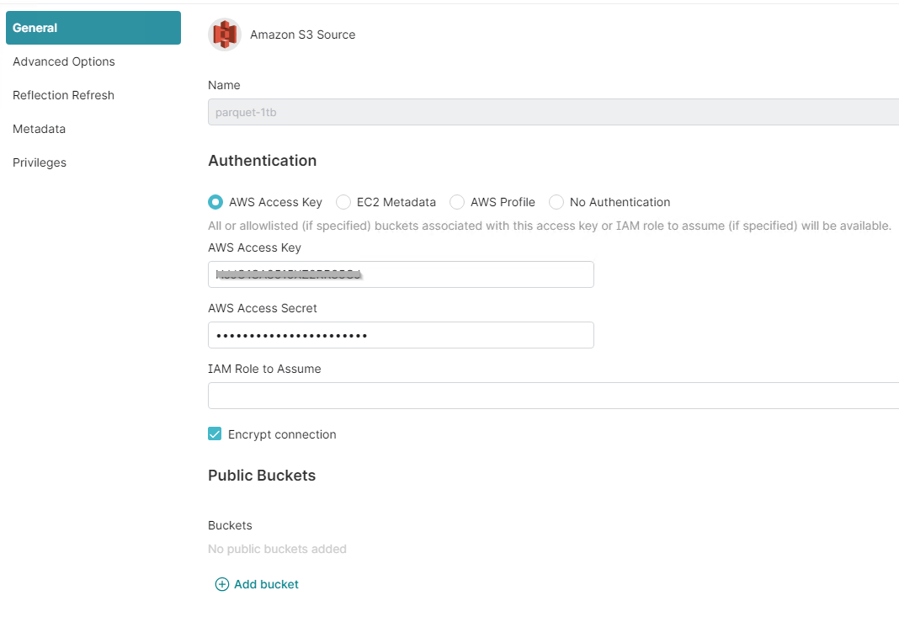
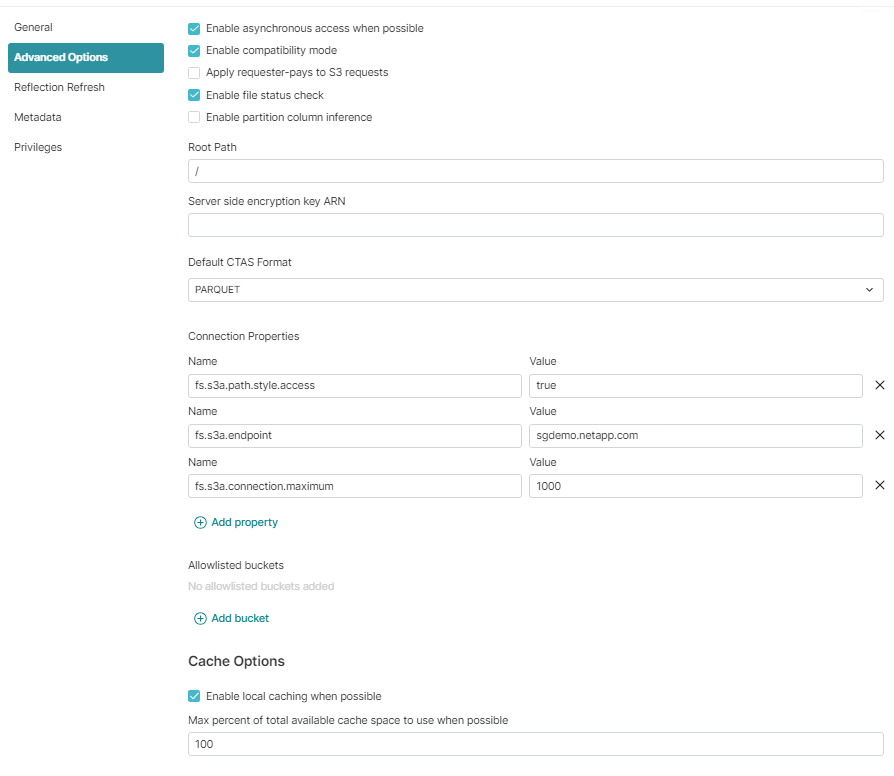
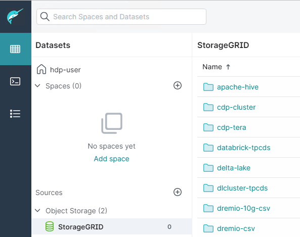

= Configurare l'origine dati Dremio con StorageGRID
:allow-uri-read: 
:icons: font
:imagesdir: ../media/
:firstname:  Angela
:authorinitials:  C
:lastname: Cheng 
:author:  Angela Cheng 
:authors:  Angela Cheng 

[role="lead"]
Dremio supporta una varietà di origini dati, incluso lo storage a oggetti on-premise o basato su cloud.  È possibile configurare Dremio in modo che utilizzi StorageGRID come origine dati dello storage a oggetti.

== Configurare l'origine dati Dremio

=== Prerequisiti

* Un URL dell'endpoint StorageGRID S3, un ID della chiave di accesso tenant S3 e una chiave di accesso segreta.
* Raccomandazione per la configurazione di StorageGRID: Disattivare la compressione (disattivata per impostazione predefinita).  +
Dremio utilizza l'intervallo di byte GET per recuperare contemporaneamente diversi intervalli di byte dall'interno dello stesso oggetto durante la query.  Le dimensioni tipiche per le richieste di intervalli di byte sono 1MB. L'oggetto compresso riduce le prestazioni di LETTURA DELL'intervallo di byte.

=== Guida di Dremio

https://docs.dremio.com/current/sonar/data-sources/object/s3/["Connessione ad Amazon S3 - Configurazione dell'archiviazione compatibile con S3"^].

== Istruzioni

. Nella pagina Datasets di Dremio, fare clic sul segno + per aggiungere un'origine, selezionare "Amazon S3".
. Immettere un nome per la nuova origine dati, l'ID della chiave di accesso tenant StorageGRID S3 e la chiave di accesso segreta.
. Selezionare la casella 'Crittografa connessione' se si utilizza https per la connessione all'endpoint StorageGRID S3. +
Se si utilizza un certificato CA autofirmato per questo endpoint S3, seguire la procedura della guida Dremio per aggiungere questo certificato CA a <JAVA_HOME>/jre/lib/Security + del server Dremio
*Esempio di screenshot*
+

. Fare clic su "Opzioni avanzate" e selezionare "attiva modalità di compatibilità"
. In Proprietà di connessione, fare clic su + Aggiungi proprietà e aggiungere queste S3A proprietà.
. fs.s3a.connection.il valore massimo predefinito è 100.  Se i set di dati S3 includono file Parquet di grandi dimensioni con 100 o più colonne, è necessario immettere un valore maggiore di 100.  Per questa impostazione, fare riferimento alla guida Dremio.
+
[cols="2a,3a"]
|===
| Nome | Valore 

 a| 
fs.s3a.endpoint
 a| 
_<StorageGRID S3 endpoint:porta>_

 a| 
fs.s3a.path.style.access
 a| 
vero

 a| 
fs.s3a.connection.maximum
 a| 
_<un valore maggiore di 100>_

|===
+
*Esempio di screenshot*

+

. Configurare altre opzioni Dremio in base ai requisiti dell'organizzazione o delle applicazioni.
. Fare clic sul pulsante Salva per creare questa nuova origine dati.
. Una volta aggiunta correttamente l'origine dati StorageGRID, viene visualizzato un elenco di bucket sul pannello di sinistra. +
*Esempio di screenshot*
+

