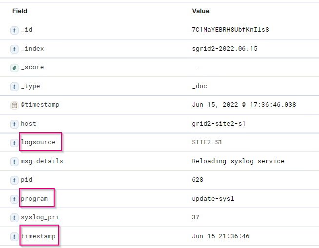
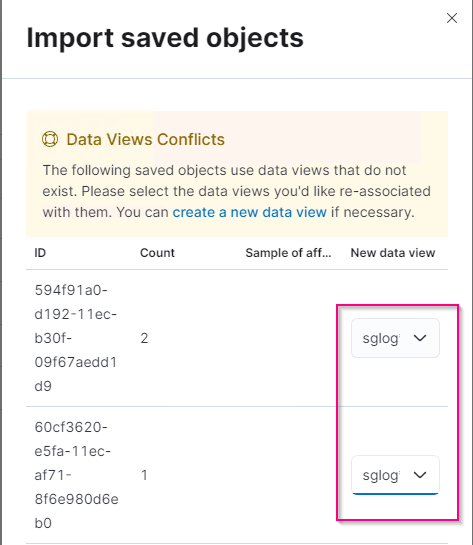

= Analisi dei log StorageGRID con stack ELK
:allow-uri-read: 

_Angela Cheng_

[role="lead"]
Con la funzione di inoltro syslog di StorageGRID 11.6, è possibile configurare un server syslog esterno per la raccolta e l'analisi dei messaggi di registro di StorageGRID. ELK (Elasticsearch, Logstash, Kibana) è diventata una delle soluzioni di analisi dei log più diffuse. Guarda il https://www.netapp.tv/details/29396["Analisi del log StorageGRID con video ELK"] Per visualizzare una configurazione ELK di esempio e come può essere utilizzata per identificare e risolvere i problemi delle richieste S3 non riuscite. Questo articolo fornisce file di esempio di configurazione di Logstash, query Kibana, grafici e dashboard per fornire un rapido avvio per la gestione dei log e l'analisi di StorageGRID.

== Requisiti

* StorageGRID 11.6.0.2 o superiore
* ELK (Elasticsearch, Logstash e Kibana) 7.1x o superiore installato e in funzione

== File di esempio

* link:../media/elk-config/elk7-sample.zip["Scarica il pacchetto di file di esempio Logstash 7.x."] + *checksum md5* 148c23d0021d9a4bb4a6c0287464deab + *checksum sha256* f51ec9e2e3f842d5a7861566b167a561beb4373038b4e7bb3c8be3d522adf2d6
* link:../media/elk-config/elk8-sample.zip["Scarica il pacchetto di file di esempio Logstash 8.x."] + *checksum md5* e11bae3a662f87c310ef363d0fe06835 + *checksum sha256* 5c670755742cfdfd5aa723a596ba087e0153a65bcaef3934afdb682f61cd278d

== Assunzione

I lettori conoscono la terminologia e le operazioni di StorageGRID ed ELK.

== Istruzioni

Due versioni di esempio sono fornite a causa delle differenze nei nomi definiti dai modelli grok. Ad esempio, il modello SYSLOGBASE grok nel file di configurazione di Logstash definisce i nomi dei campi in modo diverso a seconda della versione di Logstash installata.

[listing]
----
match => {"message" => '<%{POSINT:syslog_pri}>%{SYSLOGBASE} %{GREEDYDATA:msg-details}'}
----
*Esempio di Logstash 7.17*

*Esempio di Logstash 8.23*

image::../media/elk-config/logstash-8.x.fields-sample.png[Esempio di Logstash 8.23]

*Fasi*

. Decomprimere l'esempio fornito in base alla versione ELK installata. La cartella di esempio include due esempi di configurazione di Logstash: + *sglog-2-file.conf:* questo file di configurazione genera messaggi di log StorageGRID in un file su Logstash senza trasformazione dei dati. È possibile utilizzare questa opzione per confermare che Logstash riceve messaggi StorageGRID o per comprendere meglio i modelli di log di StorageGRID. + *sglog-2-es.conf:* questo file di configurazione trasforma i messaggi di log di StorageGRID utilizzando vari modelli e filtri. Include istruzioni drop di esempio, che consentono di eliminare i messaggi in base a modelli o filtri. L'output viene inviato a Elasticsearch per l'indicizzazione. + personalizzare il file di configurazione selezionato in base alle istruzioni contenute nel file.
. Verificare il file di configurazione personalizzato:
+
[listing]
----
/usr/share/logstash/bin/logstash --config.test_and_exit -f <config-file-path/file>
----
+
Se l'ultima riga restituita è simile alla riga seguente, il file di configurazione non presenta errori di sintassi:

+
[listing]
----
[LogStash::Runner] runner - Using config.test_and_exit mode. Config Validation Result: OK. Exiting Logstash
----
. Copiare il file di configurazione personalizzato nella configurazione del server Logstash: /Etc/logstash/conf.d + se non si è abilitato config.reload.automatic in /etc/logstash/logstash.yml, riavviare il servizio Logstash. In caso contrario, attendere lo scadere dell'intervallo di ricarica della configurazione.
+
[listing]
----
 grep reload /etc/logstash/logstash.yml
# Periodically check if the configuration has changed and reload the pipeline
config.reload.automatic: true
config.reload.interval: 5s
----
. Controllare /var/log/logstash/logstash-plain.log e verificare che non ci siano errori durante l'avvio di Logstash con il nuovo file di configurazione.
. Verificare che la porta TCP sia stata avviata e in attesa. + in questo esempio, viene utilizzata la porta TCP 5000.
+
[listing]
----
netstat -ntpa | grep 5000
tcp6       0      0 :::5000                 :::*                    LISTEN      25744/java
----
. Dalla GUI di StorageGRID Manager, configurare il server syslog esterno per l'invio dei messaggi di log a Logstash. Fare riferimento a. https://www.netapp.tv/details/29396["video dimostrativo"] per ulteriori informazioni.
. È necessario configurare o disattivare il firewall sul server Logstash per consentire la connessione dei nodi StorageGRID alla porta TCP definita.
. Dalla GUI di Kibana, selezionare Management (Gestione) -> Dev Tools (Strumenti di sviluppo). Nella pagina Console, eseguire questo comando GET per confermare la creazione di nuovi indici in Elasticsearch.
+
[listing]
----
GET /_cat/indices/*?v=true&s=index
----
. Dalla GUI di Kibana, creare un modello di indice (ELK 7.x) o una vista dati (ELK 8.x).
. Dalla GUI di Kibana, inserire "oggetti memorizzati" nella casella di ricerca situata in alto al centro. + nella pagina Saved Objects (oggetti salvati), selezionare Import (Importa). In Opzioni di importazione, selezionare "Richiedi azione in caso di conflitto"
+
image::../media/elk-config/kibana-import-options.png[Opzioni di importazione Kibana]

+
Importa elk <version>-query-chart-sample.ndjson. + quando viene richiesto di risolvere il conflitto, selezionare il modello di indice o la vista dati creata al punto 8.

+

+
Vengono importati i seguenti oggetti Kibana: + *Query* + * audit-msg-s3rq-orlm + * bycast log s3 messaggi correlati + * loglevel warning o superiore + * failed Security event + *Chart* + * s3 requests count based on bycast.log + * HTTP status code + * audit msg breakdown by type + * Average s3 Response Time + *Dashboard* + * S3 dashboard di richiesta utilizzando i grafici sopra riportati.

A questo punto, è possibile eseguire l'analisi del registro StorageGRID utilizzando Kibana.

== Risorse aggiuntive

* https://coralogix.com/blog/syslog-101-everything-you-need-to-know-to-get-started/["syslog101"]
* https://www.elastic.co/what-is/elk-stack["Cos'è lo stack ELK"]
* https://github.com/hpcugent/logstash-patterns/blob/master/files/grok-patterns["Elenco dei modelli di grok"]
* https://logz.io/blog/logstash-grok/["Guida per principianti a Logstash: Grok"]
* https://coralogix.com/blog/a-practical-guide-to-logstash-syslog-deep-dive/["Una guida pratica a Logstash: Approfondimento di Syslog"]
* https://www.elastic.co/guide/en/kibana/master/document-explorer.html["Guida di Kibana – Esplora il documento"]
* https://docs.netapp.com/us-en/storagegrid-116/audit/index.html["Riferimento ai messaggi del registro di controllo di StorageGRID"]

